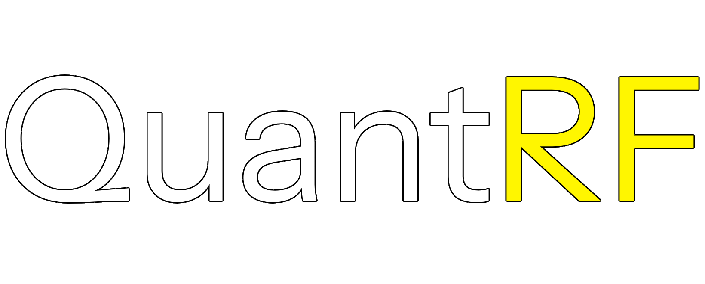

# Quant Research Framework (QRF)

Interactive open-source quantitative finance platform for exploring financial models, analysing market data, and visualizations of option pricing and risk analysis using Streamlit.

The project extends and uses **Georgios Drosogiannis** on volatility surface visualisation and interactive Black-Scholes heatmaps, together with **Killa Voillaume's** Options Greek Visualizer.

---

# Features

### Interactive Option Pricing
- Real-time option valuatoin using the Black-Scholes model
- Dynamic parameter adjustment through an interactive Streamlit interface
- Support for both European Call and Put options
- Instant recalculation of theoretical option prices.

### Options Greeks Visualisation

Explore the major sensitivty measures that describe option risk with Delta, Gamma, Theta, Vega and Rho

Visualize how each Greek changes with respect to:
- Underlying asset price
- Time to expiration
- Implied volatility
- Interest rates
- Strike price

<table>
<tr>
<td align="center">
 
<b>Delta</b>
</td>

<td align="center">
 
<b>Gamma</b>
</td>

<td align="center">
 
<b>Theta</b>
</td>
</tr>

<tr>
<td align="center">
 
<b>Vega</b>
</td>

<td align="center">
 
<b>Vega</b>
</td>

<td align="center">
 
<b>Vega</b>
</td>
</tr>

</table>

### Interactive Heatmaps

Generate interactive heatmaps illustrating relationships between stock price, strike price, time to expiration, interest rate, volatility and dividend yield.

These visualisations provide intuitive insight into multidimensional pricing behaviour that is difficult to observe through numerical outputs alone.

### Volatility Surface Analysis

Visualize three-dimensional implied volatility surface to understand how option values evolve under changing market conditions.

---

# Tech Stack

| Technology     | Purpose                                          |
| -------------- | ------------------------------------------------ |
| **Python**     | Core programming language                        |
| **NumPy**      | Numerical computing and vectorised operations    |
| **Pandas**     | Financial data manipulation and analysis         |
| **SciPy**      | Scientific computing and statistical methods     |
| **Matplotlib** | Financial plotting and visualisation             |
| **Seaborn**    | Statistical graphics and enhanced visualisations |
| **YFinance**   | Live financial market data retrieval             |
| **Streamlit**  | Interactive web application framework            |
| **Git**        | Version control and collaborative development    |

---

## Suggestions & Future Work

The Quant Research Framework is intended to evolve into a comprehensive quantitative finance platform that supports financial modelling, derivative pricing, risk management, and market research. Future development will focus on expanding the framework with additional mathematical models, numerical methods, and financial analytics commonly used in both academia and industry.

### Stochastic Processes & Asset Price Models
Future implementations may include:
- Geometric Brownian Motion (GBM)
- Black (1976) Futures Option Pricing Model
- Monte Carlo Simulation Methods
- GARCH (Generalised Autoregressive Conditional Heteroskedasticity) Models

### European Option Pricing & Lattice Models
Additoinal pricing models and numerical methods include:
- Cox-Ross-Rubinstein (1979) Binomial Tree Model
- Jarrow-Rudd (1983) Binomial Model
- Tian (1993) Binomial Tree Model
- Leisen-Reimer (1996) Binomial Tree Model
- Figlewski and Gao (1999) Adaptive Mesh Model
- Hull and White (2004) Finite Difference Methods

### American Option Pricing
Support for early exercise methods, including:
- Bjerksund-Stensland (1993)
- Brenner and Galai (1989)
- Ju-Zhong (1999)
- Bjerksund-Stensland (2002)

### Credit Risk Modelling
Future credit risk analytics may include:
- KMV-Merton Structural Credit Risk Model
- Probability of Default (PD)
- Credit Spread Analysis
- Structural and Reduced-Form Credit Risk Models

### Volatiluty & Risk Analytics
Future volatility and risk management capabilities may include:
- Variance-Covariance Matrix
- Historical Volatility
- Implied Volatility Surface Construction
- Volatility Smile and Skew Analysis
- Covariance and Correlation Analysis
- Principal Component Analysis (PCA)
- Valute at Risk (VaR)
- Conditional Value at Risk (CVaR)

## Credits

The following projects provided valuable inspiration and reference implementaitons during the development of this frameowrk:
- Georgios Drosogiannis's [https://github.com/George-Dros/Volatility_Surface](Volatility Surface Visualization) and [https://github.com/George-Dros/Black-Scholes-Interactive-heatmap](Black-Scholes Interactive Heatmap)
- Killa Voillaume's [https://github.com/George-Dros/Black-Scholes-Interactive-heatmap](Options Greek Visualizer)

## License
This project is licensed under the MIT License. See the [LICENSE](LICENSE) file for details.